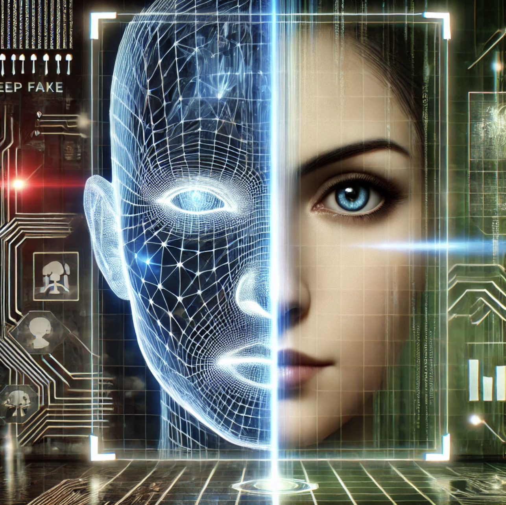

# Deep into DeepFakes

  

Aggregated references for datasets, code and papers for Deepfake detection research.

Talk : Deep into DeepFakes : Drawing a line between Real and Fake

## Open source Detection models

* **DF40**: "DF40: Toward Next-Generation Deepfake Detection", 2024: [Paper](https://arxiv.org/pdf/2406.13495)  ,  [Code](https://github.com/YZY-stack/DF40)
* **Sta4Deepfake**: "Generalizing Deepfake Video Detection with Plug-and-Play: Video-Level Blending and Spatiotemporal Adapter Tuning", 2024: [Paper](https://arxiv.org/pdf/2408.17065) ,   [Code](https://github.com/YZY-stack/StA4Deepfake)
* **SRM**: "Generalizing Face Forgery Detection with High-frequency Features", 2021: [Paper](https://ieeexplore.ieee.org/document/9578868) ,     [Code](https://github.com/SCLBD/DeepfakeBench/blob/main/training/detectors/srm_detector.py)
* **DeepfakeBench**: "DeepfakeBench: A Comprehensive Benchmark of Deepfake Detection", 2023: [Paper](https://arxiv.org/abs/2307.01426)  ,    [Code](https://github.com/SCLBD/DeepfakeBench/tree/main)

## Dataset

### Ready Public Assets

**Video and Image Datasets** : [Download Links](https://github.com/Daisy-Zhang/Awesome-Deepfakes/tree/main#datasets)

### Generation Assets
* **Roop**: [Code](https://github.com/s0md3v/roop)
* **Face Fusion**: [Code](https://github.com/facefusion/facefusion)
* **Live Portrait**: [Code](https://github.com/KwaiVGI/LivePortrait)

## Algorithm

* "FFAA: Multimodal Large Language Model based Explainable Open-World Face Forgery Analysis Assistant": [Paper](https://arxiv.org/pdf/2408.10072)    [Code](https://ffaa-vl.github.io/)

